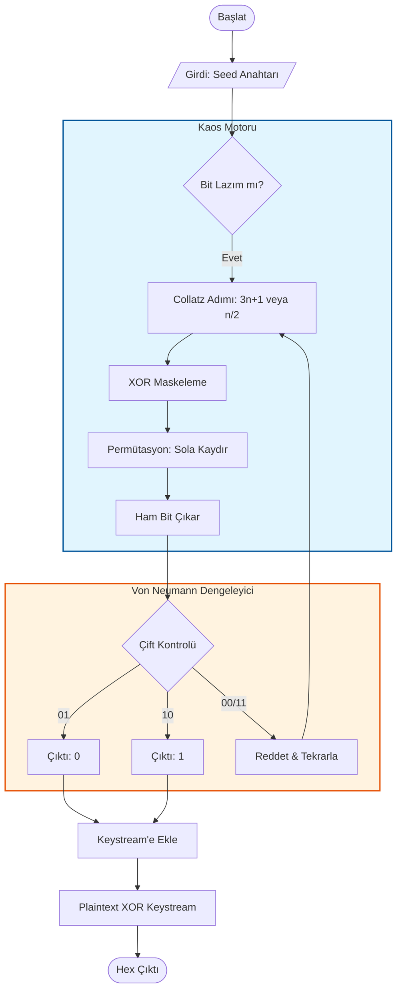

# 🎲 Collatz-XP Cipher (Collatz-XOR-Permutation)

> **"Kaos, düzenin henüz çözülememiş halidir."**

Bu proje, ünlü **Collatz Sanısı (3n+1 Problemi)**'nin matematiksel kaosunu kullanarak tasarlanmış deneysel bir **Akış Şifreleme (Stream Cipher)** algoritmasıdır. Algoritma, Collatz dizisinin tahmin edilemez yapısını **XOR Maskeleme** ve **Bit Permütasyonu** teknikleriyle birleştirerek güvenli bir anahtar akışı (keystream) üretir.

## 🚀 Özellikler

1.  **Kaotik Çekirdek (Chaos Engine):** Şifreleme anahtarı, Collatz yörüngesindeki sayılardan üretilir.
2.  **Hibrit Mimari:**
    * **Yöntem 1 (XOR):** Doğrusallığı bozmak için sabit maskeleme.
    * **Yöntem 2 (Permütasyon):** Bit difüzyonu için dairesel kaydırma (Rotate Left).
3.  **İstatistiksel Denge (Von Neumann Whitener):** Collatz dizisindeki çift sayı baskınlığını ortadan kaldırmak için Von Neumann Dengeleyicisi kullanılmıştır. Bu sayede üretilen 0 ve 1'lerin oranı istatistiksel olarak %50-%50 dengesindedir.

---

## 🛠️ Algoritma Mimarisi (Akış Şeması)

Algoritmanın çalışma mantığı aşağıdaki gibidir:

📊 İstatistiksel Analiz

Algoritmanın ürettiği anahtar akışının rastgelelik testi (1000 bitlik örneklem):
Bit Değeri	Sayı	Oran
0	         496	%49.6
1	         504	%50.4

Sonuç: Mükemmele yakın entropi dengesi.
